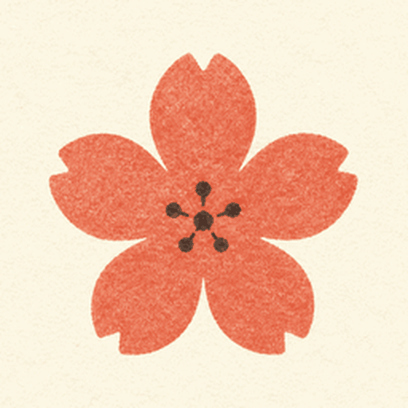
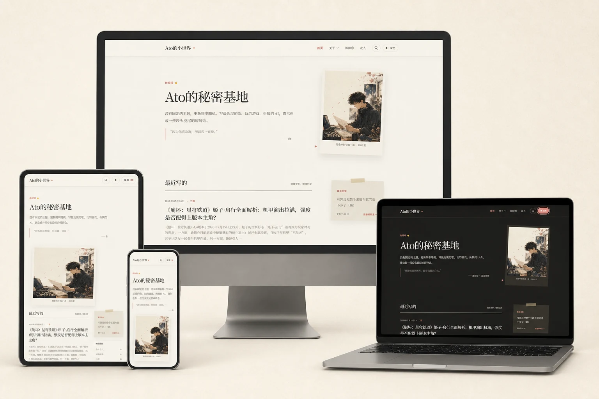

[中文](./README.md) | English

  

  <h1>Typecho Theme — Ato Paper</h1>

  
A paper-inspired Typecho theme made for personal writing and comfortable reading.

  
For everyday stories, passing thoughts, and the occasional long-form article.

  

    
    
    
    
  

  

    <a href="https://atowo.work/">Live Preview</a>
    ·
    <a href="https://github.com/liuqi19990825/Ato-Paper/releases/latest">Download</a>
    ·
    <a href="#installation-and-upgrades">Installation</a>
  

  

  Light and dark modes · Responsive desktop, tablet, and mobile layouts

---

Ato Paper is built by Ato and Codex through **vibe coding**. Current stable version: **1.0.7**.

## Contents

- [About Ato Paper](#about-ato-paper)
- [Highlights](#highlights)
- [Installation and upgrades](#installation-and-upgrades)
- [Getting started](#getting-started)
- [Article options](#article-options)
- [Comments, avatars, and notifications](#comments-avatars-and-notifications)
- [Images, code, and PJAX](#images-code-and-pjax)
- [Mobile installation](#mobile-installation)
- [License and credits](#license-and-credits)
- [Maintenance policy](#maintenance-policy)

## About Ato Paper

Ato Paper does not try to turn a personal blog into a highly structured corporate homepage. It leaves room for the writing itself: relaxed line spacing, a warm paper background, restrained coral accents, and a continuous reading experience across desktop and mobile screens.

It works especially well for:

- Everyday life, films, music, games, and AI experiments
- Short updates that do not need to become full articles
- Long-form posts that benefit from a table of contents, galleries, or code highlighting
- Personal blogs that want a subtle anime-inspired character without sacrificing readability

## Highlights

### Reading and visual design

- Paper-inspired homepage, article pages, standalone pages, and a custom 404 page
- Light and dark modes with local preference memory
- Self-hosted Noto Serif SC and Noto Sans SC variable fonts for more consistent cross-platform typography
- A unified desktop reading frame across articles, About, Murmurs, and Links pages
- Responsive mobile navigation with indented child pages and an L-shaped hierarchy marker
- Replaceable header symbol: flower, cherry blossom, sparkle, heart, clover, bow, or musical note
- Original paper-style favicon, Apple Touch Icon, and PWA installation icons
- Keyboard focus, reduced-motion support, safe-area handling, and standalone web-app display

### Content organization

- Category, tag, author, search, and archive pages
- A dedicated Murmurs timeline powered by ordinary Typecho posts
- The selected Murmurs category is automatically excluded from the homepage feed, adjacent-post navigation, and category shortcuts
- The “Recently doing” note automatically reads the newest Murmurs post
- A bookmark-style Links page with avatars, descriptions, and a link-exchange note
- Native Typecho parent/child pages with desktop dropdowns, mobile indentation, and breadcrumbs
- Homepage supporting text can be written manually or loaded from the Hitokoto API
- Configurable footer copy, social links, illustration, and Chinese registration information
- ICP and public-security registration entries are shown independently only when configured

### Article enhancements

- Custom subtitle, cover image, cover caption, and homepage excerpt
- Manual homepage excerpt with automatic content fallback
- Per-post table of contents and drop cap switches, both disabled by default
- Markdown lightbox galleries with touch, keyboard, zoom, captions, and thumbnail-to-original links
- Local syntax highlighting, language detection, and one-click code copying
- Optional copy attribution with configurable minimum selection length
- A local-only Like button stored in the visitor's browser; it does not upload visitor data or provide admin statistics

### Comments and interaction

- Native Typecho comments and nested replies
- Kaomoji, Tieba Bubble, and Bilibili reaction pickers
- A single contact field that detects either QQ or Email
- QQ email conversion and QQ avatars
- Cravatar by default, with optional Gravatar or custom-compatible avatar sources
- Paper-style CommentNotifier templates for replies, new comments, and moderation notices
- Native PJAX navigation with paper transitions and automatic full-page fallback

## Installation and upgrades

### Fresh installation

1. Download the latest archive from [Releases](https://github.com/liuqi19990825/Ato-Paper/releases).
2. Extract it and upload the complete <code>AtoPaper</code> directory to <code>/usr/themes/</code>.
3. Open “Console → Appearance” in the Typecho admin panel and activate **Ato Paper**.
4. Open “Set up appearance” and configure the homepage, social links, registration numbers, and optional features.

### Upgrading

Upload the new theme files over the old directory. Theme options are stored in the Typecho database and normally remain intact.

Before upgrading:

- Back up the current theme directory and Typecho database
- Record any custom CSS, template edits, or plugin configuration
- If the site was installed to a mobile home screen, remove the old installation before installing the updated version again

CSS and JavaScript URLs include the current theme version, so browsers request fresh resources after an upgrade.

## Getting started

### Create the Murmurs page

1. Create a category in “Manage → Categories”, for example “Murmurs” with the slug <code>murmurs</code>.
2. Create or edit a standalone page and select the **Murmurs** custom template.
3. Choose that category under “Appearance → Murmurs category”, then point “Murmurs page URL” to the page.
4. Publish short updates as ordinary posts assigned to the Murmurs category.

Murmurs entries remain native Typecho posts, so they support Markdown, images, attachments, comments, and individual permalinks. The default page size is eight entries. If no category is selected, Ato Paper can still read the legacy <code>Date|Label|Title|Body</code> text format.

When a Murmurs entry has no title, the timeline hides Typecho's “Untitled Document” placeholder.

### Create the Links page

1. Create a standalone page titled “Links” or “Friends”.
2. Select the **Links Page** custom template.
3. Add one site per line under “Appearance → Links list”:

~~~text
Site Name|https://example.com/|https://example.com/avatar.png|A short description
~~~

The avatar and description may be omitted. The standalone page body appears below the cards as a link-exchange note.

### Parent and child pages

Select a parent when editing a Typecho standalone page. Ato Paper automatically builds a two-level navigation structure: desktop dropdowns, indented mobile children, and a breadcrumb on child pages.

Direct child pages are also listed after a normal parent page's content. Keeping frequently used pages within two levels is recommended.

## Article options

Expand the advanced options while editing an article or normal standalone page:

- **Homepage excerpt**: manual text takes priority; an excerpt is generated from the content when left empty
- **Article subtitle**
- **Article cover URL**
- **Cover caption**
- **Table of contents**: reads level-two and level-three headings and displays a desktop sidebar
- **Drop cap**: enlarges the first character of the first content paragraph

All fields are optional. The table of contents and drop cap also work on normal standalone pages.

## Comments, avatars, and notifications

### QQ or Email contact

The default contact mode automatically detects QQ or Email:

- Visitors enter either value in one field
- A valid QQ number is converted to <code>QQ-number@qq.com</code> before submission
- Email uses the selected avatar service
- Valid QQ email patterns load Tencent QQ avatars
- Existing comments, remembered visitor details, and nested replies require no migration

Switch the option to “Email only” if QQ support is not wanted.

### Comment reactions

- **Kaomoji** inserts normal copyable text
- **Tieba Bubble** stores safe tokens such as <code>:huaji:</code> and renders local images
- **Bilibili** stores safe tokens such as <code>{{doge}}</code> and renders local sprite reactions

Tokens remain plain text in the Typecho database. Animated Bilibili reactions stay paused until hovered or keyboard-focused.

### CommentNotifier email templates

Three templates are included under <code>integrations/CommentNotifier/AtoPaper/</code>:

- <code>guest.html</code>: reply notification for a visitor
- <code>owner.html</code>: new-comment notification for the author or site owner
- <code>notice.html</code>: moderation notification

Setup:

1. Install [jrotty/CommentNotifier](https://github.com/jrotty/CommentNotifier) as <code>/usr/plugins/CommentNotifier/</code>.
2. Enable it and test the SMTP configuration.
3. Copy <code>integrations/CommentNotifier/AtoPaper</code> to <code>/usr/plugins/CommentNotifier/template/AtoPaper</code>.
4. Enable **Ato Paper** under the CommentNotifier template settings.
5. Set the reaction reload callback to <code>ato_comment_notifier_emotes</code>.

QQ contacts receive notifications through the corresponding QQ email address. Never place SMTP passwords inside template files.

### Avatar sources

Available avatar modes:

- **Cravatar**: the default China-friendly source
- **Gravatar**
- **Custom-compatible source**: an <code>/avatar/</code> base URL or a complete template containing <code>{hash}</code>

The fallback avatar accepts styles such as <code>identicon</code>, <code>mp</code>, and <code>retro</code>, or a public image URL. SM.MS may host a fallback image, but it cannot resolve avatars by email.

## Images, code, and PJAX

### Lightbox galleries

Markdown images on articles and normal standalone pages automatically form a gallery:

~~~markdown

~~~

Use a thumbnail that links to the original for large images:

~~~markdown

~~~

Add <code>data-no-lightbox</code> to an HTML image that should not open in the gallery. All lightbox assets are bundled locally and reinitialize after PJAX navigation.

### Code highlighting

Specify a language on a Markdown code fence, such as <code>~~~php</code>, or let the theme detect it automatically. Highlight.js is bundled locally and no CDN is required.

### PJAX navigation

PJAX is enabled by default and can be disabled in the appearance settings. Comments, search, downloads, external links, and Typecho admin URLs still use standard navigation. Failed PJAX requests fall back to a full-page load.

Plugins may add <code>data-no-pjax</code> to links or listen for <code>ato:page-ready</code> and <code>ato:pjax:complete</code>.

## Enable the themed 404 page

If Nginx displays its default 404 page, make sure the site's existing <code>server { ... }</code> contains:

~~~nginx
location / {
    try_files $uri $uri/ /index.php?$query_string;
}
~~~

Modify the existing <code>location /</code> block instead of adding a duplicate. Run <code>nginx -t</code> before reloading Nginx. A ready-to-copy example is included as <code>nginx-typecho.conf.example</code>.

Missing URLs continue to return the correct HTTP 404 status while displaying the Ato Paper design.

## Mobile installation

The theme includes <code>manifest.json</code>, 192px and 512px icons, a maskable icon, standalone display mode, and safe-area support. When installed from Chrome, the site uses paper-inspired system colors and launch backgrounds.

Final system-bar colors may still depend on the Android version, device vendor, and gesture-navigation settings.

## License and credits

Original Ato Paper code and assets are released under the permissive [MIT License](LICENSE). Copyright and license notices must be retained.

The complete distribution is not covered by MIT alone:

- <code>inc/emotes.php</code>, <code>assets/emotes/tieba/</code>, and <code>assets/emotes/bilibili/</code> contain or adapt GPL v2-or-later material from Sakura
- Highlight.js, GLightbox, and Noto fonts retain their own licenses
- Keep <code>LICENSE</code>, <code>THIRD_PARTY_NOTICES.md</code>, and the <code>licenses/</code> directory when redistributing the full theme

The kaomoji list, Tieba Bubble reactions, and Bilibili assets come from the 3.x branch of [mashirozx/Sakura](https://github.com/mashirozx/Sakura), based on commit <code>9a7a597ac18219bf4202b76c150bec6c16664b7c</code>. The QQ-to-email and QQ-avatar approach was also inspired by Sakura and reimplemented for Typecho.

Syntax highlighting uses the local browser build of [Highlight.js](https://github.com/highlightjs/highlight.js) 11.11.1. See <code>THIRD_PARTY_NOTICES.md</code> for the complete file and modification boundaries.

## Maintenance policy

Ato Paper is a personal vibe-coding project:

- Ato defines the requirements, visual direction, content, and deployment feedback
- Codex assists with design, implementation, review, and iteration
- Pull Requests, patches, and other external code merges are not accepted
- Please Fork the repository and maintain your own variant if you want to extend it

Issues or Discussions may be used to share experiences and ideas, but long-term support is not guaranteed.

## Compatibility

- Typecho 1.3.0
- PHP 7.4 or later
- A recent version of Chrome, Edge, Firefox, or Safari is recommended

If you build your own variant, feel free to leave a link on the project page.
